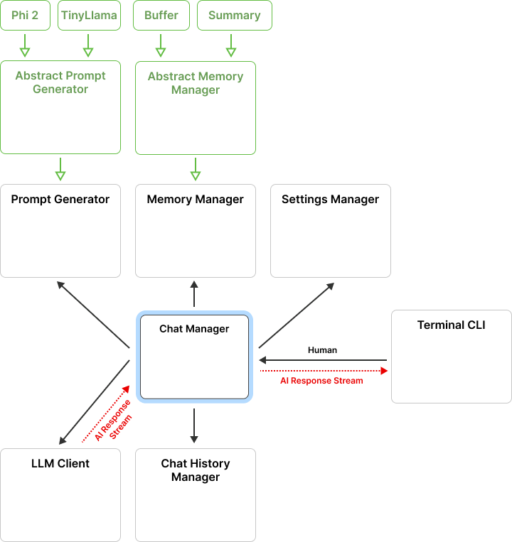

# LLM Chatbot

## Overview

The LLM Chatbot is a Java-based application that interacts with users via a terminal interface. It communicates with a Python backend hosting the Large Language Model (LLM) of choice, providing chat management functionality and the ability to save conversations. The Python backend operates locally on a CPU, which may result in slower performance and response times due to the lack of GPU/TPU acceleration.

**Note:** The Docker image for the LLM is approximately 4GB in size. Ensure that your system has enough RAM and storage to handle this efficiently, especially when running multiple instances.

**Note:** Shell scripts provided in this project may not work as expected on Windows due to differences in the Unix and Windows command-line environments. To fix this, you can try to use it via **WSL**.

## Quickstart

### System Requirements

Before initiating, ensure your system meets the following prerequisites:

- Docker installed (^4.28.0)
  - Supported versions:
    - Docker Desktop (^4.28.0)
    - Docker Engine (^26.0.0)
- A compatible operating system and CPU architecture:
  - Linux, Windows with x86_64 (amd64) CPU
  - macOS with Apple Silicon (arm64) CPU
- At least 5GB of available disk space
- At least 4GB of RAM

### Running the Application

Depending on your CPU architecture, use the appropriate shell command to start the application.

- **For Apple Silicon ARM CPU:**

```sh
sh run.arm.sh
```

- **For amd64 CPU:**

```sh
sh run.amd64.sh
```

The difference lies in the Docker image used for the LLM, which needs to be compiled separately for ARM and amd64 architectures to ensure optimal performance.

### Troubleshooting Startup Scripts

If you encounter any issues with the startup scripts, follow these steps to manually start the application:

1. **Start the LLM Docker Container:**

Replace `<LLM>` with `<llmb-amd64>` for amd64 CPUs or `<llmb>` for Apple Silicon ARM CPUs:

     ```sh
     docker run --rm -d -p 9000:9000 --name server vlkkarel/<LLM>
     ```

2. **Build the Java Client App Docker Container:**

   ```sh
   docker build --no-cache -t java-chatbot .
   ```

3. **Run the Built Java Client Docker Container:**

   ```sh
   docker run --rm -it --link server java-chatbot
   ```

## App architecture diagram



## Functionalities

The User Interface allows users to manage and interact with the chatbot effectively. Here are the key functionalities that offers:

1. **Dynamic Input Handling**:

   - In COMMAND mode, it prompts with "Your action: ".
   - In CHAT mode, it prompts with "You: ".

2. **Command Support**: Users can execute several commands to control the chatbot:

   - `/new`: Starts a new chat session.
   - `/help`: Displays help information about the application and available commands.
   - `/home`: Returns to the main menu.
   - `/history`: Shows the chat history.
   - `/memory`: Provides options to configure memory management settings.
   - `/model`: Allows selection between different LLM models.
   - `/exit`: Exits the application.

3. **Chat Management**: Manages the flow of the chat sessions and processes user input with the following features:

   - _Chat History Addition_:
     - Adds messages to the history as they are processed.
   - _Session Management_:
     - Start and end chat sessions.
     - Loading historical chats that allows users to view and load previous chat sessions.

4. **Memory and Model Configuration**:
   - _Memory Options_:
     - **Buffer memory**: Utilizes a fixed-size buffer to maintain recent conversation context, offering fast performance suitable for most real-time interactions.
     - **Summary memory**: Summarizes the conversation's context by LLM to preserve critical information over longer interactions, but can increase response times due to LLM summary request.
   - _Model Options_:
     - **Phi-2**: A balanced language model known for efficient processing and high accuracy across diverse conversational scenarios.
     - **TinyLlama**: A smaller, more lightweight model optimized for faster responses and lower resource usage.

## Documentation

The generated JavaDoc documentation for this project is stored in the `doc/` directory. You can generate this documentation using a Docker container by running:

```sh
sh generate-doc.sh
```

Generated documentation is then located in `target/site/` directory.
