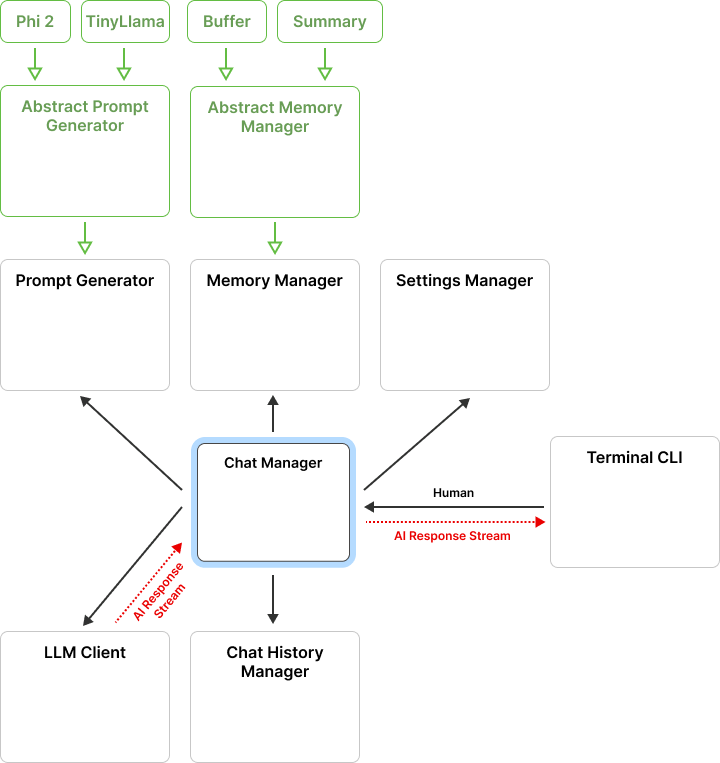

# Chatbot Documentation

This project facilitates communication with a Large Language Model (LLM) client through a modular system architecture implemented in C# (.NET 8.0). It is designed to manage user interactions, generate prompts, maintain conversation history, and interface with an LLM client. The architecture ensures clear separation of concerns, maintainability, and extensibility.

The system is designed with a clear separation of concerns, leveraging object-oriented principles to ensure each component has a well-defined responsibility. The interaction between components is managed through well-defined interfaces and methods, promoting modularity and ease of maintenance. This architecture not only makes the system robust but also allows for easy extension and integration of additional features or components in the future.

## App architecture diagram

  

## Main System Components

- **ChatManager**: The central hub coordinating communication between the user, LLM client, and other system components. It handles message exchange, updates chat history, and manages settings.
- **ChatHistoryManager**: Manages storage and retrieval of chat history, preserving past interactions for context and review.
- **LLMClient**: Interfaces with the external LLM service, sending user-generated prompts and receiving responses.
- **SettingsManager**: Manages configuration settings, allowing customization and configuration of various parameters.
- **TerminalInterface**: Provides a command-line interface (CLI) for user interaction, enabling users to input messages and view responses.
- **MemoryManager**: Manages short-term and long-term memory for maintaining context during conversations. Includes subclasses like BufferMemory and SummaryMemory.
- **PromptGenerator**: Generates prompts for the LLM based on user input and context from MemoryManager.

**NOTE**: The documentation below, describing modules, classes, and methods, is based on the `chatbot.xml` file. This file was generated from XML documentation comments within the code. This human readable markdown was created using OpenAI's ChatGPT-4o model, and while it aims for accuracy, there may be some errors or inconsistencies.

---

## Namespace: `chatbot`

### Classes

#### ChatHistoryManager

The `ChatHistoryManager` class is responsible for managing the chat history of a chatbot session. It provides methods to store and load chat history, as well as list all available chat history files.

##### Constructor

**`ChatHistoryManager(string directoryPath)`**

- **Parameters:**
  - `directoryPath`: The path to the directory where chat history will be stored.

##### Methods

**`string GetChatSessionFileName(string sessionId)`**

- **Summary:** Returns the file name for a chat session based on the session ID.
- **Parameters:**
  - `sessionId`: The ID of the chat session.
- **Returns:** The file name for the chat session.

**`void StoreChatHistory(string sessionId, List<string> chatHistory, List<string> memory)`**

- **Summary:** Stores the chat history and memory for a given session.
- **Parameters:**
  - `sessionId`: The ID of the chat session.
  - `chatHistory`: The list of chat messages in the session.
  - `memory`: The list of memory items associated with the session.

**`ChatSession LoadChatHistory(string fileName)`**

- **Summary:** Load a specific chat history by file name.
- **Parameters:**
  - `fileName`: The name of the file to load the chat history from.
- **Returns:** The loaded chat session.

**`List<string> ListChatHistories()`**

- **Summary:** Returns a list of chat histories.
- **Returns:** A list of chat histories.

#### ChatHistoryManager.ChatSession

Inner class to represent a chat session including chat history and memory.

##### Properties

**`List<string> ChatHistory { get; set; }`**

- **Summary:** Gets or sets the chat history.

**`List<string> Memory { get; set; }`**

- **Summary:** Gets or sets the memory.

##### Constructors

**`ChatSession()`**

- **Summary:** Creates a new instance of the ChatSession class without history or memory.

**`ChatSession(List<string> chatHistory, List<string> memory)`**

- **Summary:** Creates a new instance of the ChatSession class with the specified chat history and memory.
- **Parameters:**
  - `chatHistory`: The chat history.
  - `memory`: The memory.

##### Methods

**`string ToYaml()`**

- **Summary:** Converts the `ChatSession` object to a YAML string representation.
- **Returns:** The YAML string representation of the `ChatSession` object including chat history and memory.

**`ChatSession FromYaml(string yamlString)`**

- **Summary:** Loads a `ChatSession` object from a YAML string.
- **Parameters:**
  - `yamlString`: The YAML string to load the `ChatSession` object from.
- **Returns:** The `ChatSession` object loaded from the YAML string.

#### ChatManager

The `ChatManager` class is responsible for managing the chat functionality of the chatbot. It handles the communication between the user and the AI model, manages the chat history, and provides methods for updating the model and memory settings.

##### Constructor

**`ChatManager(SettingsManager settingsManager, IMessageConsumer messageConsumer)`**

- **Parameters:**
  - `settingsManager`: The settings manager used to retrieve configuration settings.
  - `messageConsumer`: The message consumer used to consume chat messages.

##### Methods

**`LLMClient BuildLLMClient(SettingsManager settingsManager)`**

- **Summary:** Builds and returns an instance of the `LLMClient` class.
- **Parameters:**
  - `settingsManager`: The settings manager to be used by the `LLMClient`.
- **Returns:** An instance of the `LLMClient` class.

**`PromptGenerator BuildPromptGenerator(SettingsManager settingsManager)`**

- **Summary:** Builds and returns an instance of the `PromptGenerator` class based on the model type.
- **Parameters:**
  - `settingsManager`: The settings manager to be used by the `PromptGenerator`.
- **Returns:** An instance of the `PromptGenerator` class.

**`ChatHistoryManager BuildChatHistoryManager(SettingsManager settingsManager)`**

- **Summary:** Builds and returns an instance of the `ChatHistoryManager` class.
- **Parameters:**
  - `settingsManager`: The settings manager to be used by the `ChatHistoryManager`.
- **Returns:** An instance of the `ChatHistoryManager` class.

**`MemoryManager BuildMemoryManager(SettingsManager settingsManager)`**

- **Summary:** Builds and returns an instance of the `MemoryManager` class based on the memory type.
- **Parameters:**
  - `settingsManager`: The settings manager to be used by the `MemoryManager`.
- **Returns:** An instance of the `MemoryManager` class.

**`void AddToHistory(string message)`**

- **Summary:** Adds a message to the memory manager's chat history.
- **Parameters:**
  - `message`: The message to be added to the history.

**`void ReceivedEndAIMessage()`**

- **Summary:** Method to be called when the AI model sends the whole message.

**`void UpdateModel(ModelType model)`**

- **Summary:** Updates the model used by the chatbot. This method updates the settings manager, ends the current chat session, rebuilds the prompt generator with the updated settings, and starts a new chat session.
- **Parameters:**
  - `model`: The new model to be used.

**`void UpdateMemory(MemoryType memory)`**

- **Summary:** Updates the memory of the chat manager with the specified memory type. This method updates the settings manager, ends the current chat session, rebuilds the memory manager with the updated settings, and starts a new chat session.
- **Parameters:**
  - `memory`: The memory type to update the chat manager with.

**`void EndChatSession()`**

- **Summary:** Ends the current chat session by storing the chat history and context. If there is no active session, this method does nothing.

**`string GetModelType()`**

- **Summary:** Returns the model type from setting manager.
- **Returns:** The model type as a String.

**`string GetMemoryType()`**

- **Summary:** Returns the memory type from setting manager.
- **Returns:** The memory type setting as a String.

**`void LoadHistory(string fileName)`**

- **Summary:** Loads the chat history from the specified file. Chat history and context are set in the memory manager.
- **Parameters:**
  - `fileName`: The name of the file containing the chat history.

**`List<string> ListHistories()`**

- **Summary:** Returns a list of chat histories.
- **Returns:** A list of chat histories.

**`void StartChatSession()`**

- **Summary:** Starts a new chat session. Generates a new session ID based on the current system time and resets the memory manager.

**`void ProcessInput(string input)`**

- **Summary:** Processes the user input.
- **Parameters:**
  - `input`: The user input to process.

**`int GetMaxTokensForContext(string input)`**

- **Summary:** Returns the maximum number of tokens allowed for a given input context. The maximum number of tokens is calculated by subtracting the length of the input string (split by spaces) from the maximum tokens value, and then subtracting an additional 30 tokens.
- **Parameters:**
  - `input`: The input string representing the context.
- **Returns:** The maximum number of tokens allowed for the given context.

**`string Summarize(string input)`**

- **Summary:** Summarizes the given input using a prompt generator and sends the query to the LLM client.
- **Parameters:**
  - `input`: The input to be summarized.
- **Returns:** The summarized output as a string.

**`void StartLoadingAnimation()`**

- **Summary:** Starts the loading animation. The animation consists of a rotating set of characters that are printed to the console. The animation continues until the `running` flag is set to false. The animation is cleared from the terminal once it is stopped.

**`void StopLoadingAnimation()`**

- **Summary:** Stops the loading animation and interrupts the animation thread.

#### ChatManager.MessageConsumerWithStopAnimation

A decorator class that stops the loading animation before accepting and processing a message.

##### Methods

**`void AcceptMessage(string message)`**

- **Summary:** Accepts a message and performs necessary actions. This method stops the loading animation before showing the message.
- **Parameters:**
  - `message`: The message to be accepted.

**`void Initialize()`**

- **Summary:** Initializes the ChatManager's LLMClient.

#### LLMClient

The `LLMClient` class represents a client for communicating with the LLM server. It provides methods for initializing the LLM, sending queries, and retrieving responses.

##### Constructor

**`LLMClient(SettingsManager settings, IMessageConsumer messageConsumer)`**

- **Parameters:**
  - `settings`: The settings manager for the client.
  - `messageConsumer`: The message consumer for processing received messages.

##### Methods

**`bool InitializeLLM()`**

- **Summary:** Initializes the LLM by sending an HTTP POST request to the LLM server. This method constructs a JSON payload with the necessary settings and sends it as the request body. The response from the server is printed to the console.
- **Returns:** `true` if the initialization is successful, `false` otherwise.

**`string SanitizePrompt(string prompt)`**

- **Summary:** Sanitizes the given prompt by escaping special characters.
- **Parameters:**
  - `prompt`: The prompt to be sanitized.
- **Returns:** The sanitized prompt.

**`void SendQuery(string query)`**

- **Summary:** Sends a query to the server and processes the response.
- **Parameters:**
  - `query`: The query to send to the server.

**`string SendQuerySync(string query)`**

- **Summary:** Sends a synchronous query to the server and returns the response as a string.
- **Parameters:**
  - `query`: The query to send to the server.
- **Returns:** The response from the server as a string.

#### MemoryManagers.BufferMemoryManager

The `BufferMemoryManager` class extends the `MemoryManager` abstract class and represents a memory manager that stores chat history in a buffer. It keeps track of the chat history and provides methods to add messages, retrieve context, and reset the memory.

##### Methods

**`List<string> GetContext(int maxContextTokens)`**

- **Summary:** Retrieves the context from the chat history. Context is a list of previous messages in maximum length of maxContextTokens.
- **Parameters:**
  - `maxContextTokens`: The maximum number of tokens allowed in the context.
- **Returns:** A list of strings representing the context from the chat history.

**`string GetContextString(int maxContextTokens)`**

- **Summary:** Returns a string representation of the context tokens up to the specified maximum number of tokens.
- **Parameters:**
  - `maxContextTokens`: The maximum number of context tokens to include in the string representation.
- **Returns:** A string representation of the context tokens.

#### MemoryManagers.IMemoryManager

The `IMemoryManager` interface represents a memory manager for a chatbot. It provides methods to add messages, reset the memory, retrieve context information, and manage the chat history.

##### Methods

**`void AddMessage(string message)`**

- **Summary:** Adds a message to the memory.
- **Parameters:**
  - `message`: The message to be added.

**`void Reset()`**

- **Summary:** Resets the memory, clearing all stored information.

**`string GetContextString(int maxContextTokens)`**

- **Summary:** Retrieves the context string up to the specified maximum number of tokens.
- **Parameters:**
  - `maxContextTokens`: The maximum number of tokens to retrieve.
- **Returns:** The context string.

**`List<string> GetChatHistory()`**

- **Summary:** Retrieves the chat history.
- **Returns:** The chat history.

**`List<string> GetContext(int maxContextTokens)`**

- **Summary:** Retrieves the context up to the specified maximum number of tokens.
- **Parameters:**
  - `maxContextTokens`: The maximum number of tokens to retrieve.
- **Returns:** The context.

**`void SetChatHistory(List<string> chatHistory)`**

- **Summary:** Sets the chat history.
- **Parameters:**
  - `chatHistory`: The chat history to set.

**`void SetContext(List<string> context)`**

- **Summary:** Sets the context.
- **Parameters:**
  - `context`: The context to set.

**`void ReceivedEndAIMessage()`**

- **Summary:** Notifies the memory manager that an end AI message has been received.

#### MemoryManagers.MemoryManager

Represents an abstract base class for memory managers in the chatbot system that implements `IMemoryManager` interface.

##### Fields

**`List<string> chatHistory`**

- **Summary:** List of strings representing the chat history.

##### Methods

**`void AddMessage(string message)`**

- **Summary:** Adds a new message to the chat history. If the last message in the chat history is "AI: " (added before calling LLM) and the new message is not from the user, the new message is concatenated to the last message because it must be in format Who: What. Otherwise, the new message is added as a separate entry in the chat history.
- **Parameters:**
  - `message`: The message to be added to the chat history.

**`void Reset()`**

- **Summary:** Resets the summary memory by clearing the chat history.

**`void ReceivedEndAIMessage()`**

- **Summary:** This method is called when the end of an AI message is received. It does nothing by default.

**`void SetContext(List<string> context)`**

- **Summary:** This method is called when the context is set. By default, it does nothing.
- **Parameters:**
  - `context`: The context to be set.

**`List<string> GetChatHistory()`**

- **Summary:** Returns the chat history as a list of strings.
- **Returns:** The chat history as a list of strings.

**`void SetChatHistory(List<string> chatHistory)`**

- **Summary:** Sets the chat history of the SummaryMemoryManager object.
- **Parameters:**
  - `chatHistory`: The list of strings representing the chat history.

**`string GetContextString(int maxContextTokens)`**

- **Summary:** Returns the context summary string.
- **Parameters:**
  - `maxContextTokens`: The maximum number of context tokens to include.
- **Returns:** The context string.

**`List<string> GetContext(int maxContextTokens)`**

- **Summary:** Retrieves the context up to the specified maximum number of tokens.
- **Parameters:**
  - `maxContextTokens`: The maximum number of tokens to retrieve.
- **Returns:** The context.

#### MemoryManagers.SummaryMemoryManager

The `SummaryMemoryManager` class extends the `MemoryManager` abstract class and represents the memory component of a chatbot that summarizes the history. It keeps track of the chat history, context, and provides methods to manipulate and retrieve the chat history and context.

##### Constructor

**`SummaryMemoryManager(int maxContextTokens, ChatManager chatManager)`**

- **Parameters:**
  - `maxContextTokens`: The maximum number of context tokens to store.
  - `chatManager`: The chat manager associated with this memory.

##### Methods

**`string GetContextString(int maxContextTokens)`**

- **Summary:** Returns the context summary string.
- **Parameters:**
  - `maxContextTokens`: The maximum number of context tokens to include.
- **Returns:** The context string.

**`List<string> GetContext(int maxContextTokens)`**

- **Summary:** Retrieves the list of strings of size 1 that contains context of the memory.
- **Parameters:**
  - `maxContextTokens`: The maximum number of context tokens to retrieve.
- **Returns:** A list of strings of size 1 representing the context.

**`void SetContext(List<string> context)`**

- **Summary:** Sets the context for the SummaryMemoryManager. If the context size is less than or equal to 1, the first element of the context list is stored in the context array. If the context size is 0, an empty string is stored in the context array. If the context size is greater than 1, the history is summarized by LLM.
- **Parameters:**
  - `context`: The list of strings representing the context.

**`void ReceivedEndAIMessage()`**

- **Summary:** This method is called when an end AI message is received. It triggers the summarization of the chat history.

**`string GetHistoryContext(int maxContextTokens)`**

- **Summary:** Returns a string representing the history context of the chat.
- **Parameters:**
  - `maxContextTokens`: The maximum number of tokens allowed in the context.
- **Returns:** The history context as a string.

**`void SummarizeHistory()`**

- **Summary:** Summarizes the chat history. The summarized context is obtained by calling the `Summarize` method of the `chatManager` object. If the chat history context is empty, an empty string is stored in the memory.

#### IMessageConsumer

The `IMessageConsumer` interface represents an object that can consume messages. Implementations of this interface can be used to process incoming messages in a chatbot system.

##### Methods

**`void AcceptMessage(string message)`**

- **Summary:** Accepts a message for processing.
- **Parameters:**
  - `message`: The message to be processed.

#### Program

The main class of the chatbot application.

##### Methods

**`void Main(string[] args)`**

- **Summary:** The entry point of the chatbot application.
- **Parameters:**
  - `args`: The command line arguments.

#### PromptGenerators.IPromptGenerator

The `IPromptGenerator` interface provides methods for generating prompts in a chatbot.

##### Methods

**`string GeneratePrompt(string userInput, string context)`**

- **Summary:** Generates a prompt based on the user input and context.
- **Parameters:**
  - `userInput`: The user input.
  - `context`: The context of the conversation.
- **Returns:** The generated prompt.

**`string GetSummarizePrompt(string userInput)`**

- **Summary:** Generates a prompt for summarizing the user input.
- **Parameters:**
  - `userInput`: The user input.
- **Returns:** The generated prompt for summarization.

#### PromptGenerators.PhiPromptGenerator

This class represents a prompt generator for the Phi chatbot. It extends the base `PromptGenerator` class. The `PhiPromptGenerator` generates prompts for the chatbot by formatting the system prompt, user input, and context. It also provides a method to generate a prompt for summarizing the chat.

##### Constructor

**`PhiPromptGenerator(string systemPrompt)`**

- **Parameters:**
  - `systemPrompt`: The system prompt to be used by the PhiPromptGenerator.

##### Methods

**`string GeneratePrompt(string userInput, string context)`**

- **Summary:** Generates a prompt for the chatbot conversation.
- **Parameters:**
  - `userInput`: The user's input.
  - `context`: The context of the conversation.
- **Returns:** The generated prompt.

**`string GetSummarizePrompt(string userInput)`**

- **Summary:** Generates a prompt for summarizing the chat based on the user input.
- **Parameters:**
  - `userInput`: The user input to be summarized.
- **Returns:** The generated prompt for summarizing the chat.

#### PromptGenerators.PromptGenerator

The abstract class `PromptGenerator` is the base class for generating prompts in a chatbot. It provides a common structure and behavior for prompt generators.

##### Methods

**`string GeneratePrompt(string userInput, string context)`**

- **Summary:** Generates a base prompt based on the user input and context.
- **Parameters:**
  - `userInput`: The user input.
  - `context`: The context of the conversation.
- **Returns:** The generated prompt.

**`string GetSummarizePrompt(string userInput)`**

- **Summary:** Generates a base prompt for chat summarization.
- **Parameters:**
  - `userInput`: The user input to be summarized.
- **Returns:** The generated prompt for chat summarization.

#### PromptGenerators.TinyLLamaPromptGenerator

This class represents a prompt generator for the TinyLLama chatbot. It extends the base class `PromptGenerator` and provides methods to generate prompts for the chatbot.

##### Constructor

**`TinyLLamaPromptGenerator(string systemPrompt)`**

- **Parameters:**
  - `systemPrompt`: The system prompt to be used by the prompt generator.

##### Methods

**`string GeneratePrompt(string userInput, string context)`**

- **Summary:** Generates a prompt by formatting the given user input and context into a pattern.
- **Parameters:**
  - `userInput`: The user's input.
  - `context`: The context for the prompt.
- **Returns:** The generated prompt.

**`string GetSummarizePrompt(string userInput)`**

- **Summary:** Generates a prompt for chat summarization.
- **Parameters:**
  - `userInput`: The user input to be summarized.
- **Returns:** The generated prompt for chat summarization.

#### MemoryType

Represents the type of memory used by the chatbot. The chatbot can use either a buffer memory or a summary memory.

##### Fields

**`BUFFER`**

- **Summary:** Buffer memory type using chat history buffer to remember up to max tokens.

**`SUMMARY`**

- **Summary:** Summary memory type using only summaries provided by LLM from chat history.

#### ModelType

Represents the type of model used in the chatbot. The available model types are PHI2 and TINYLLAMA.

##### Fields

**`PHI2`**

- **Summary:** Microsoft's PHI2 model.

**`TINYLLAMA`**

- **Summary:** TinyLlama model.

#### SettingsManager

The `SettingsManager` class is responsible for managing the settings of the chatbot. It provides methods to load, save, and update the settings.

##### Constructor

**`SettingsManager(string settingsPath)`**

- **Parameters:**
  - `settingsPath`: The path to the settings file.

##### Methods

**`void LoadSettings()`**

- **Summary:** Loads the settings from a file. If the file exists, it loads the settings from the file. If the file does not exist, it sets default values for the settings. If an error occurs while loading the settings, it prints an error message and sets default values.

**`void SetDefaultSettings()`**

- **Summary:** Sets the default settings for the chatbot. These settings include the base URL, model, memory, stopAt, maxTotalTokens, quantization, skills, historyPath, and system prompts.

**`void SaveSettings()`**

- **Summary:** Saves the current settings to a file.

**`string GetSetting(string key)`**

- **Summary:** Retrieves the value of the specified setting.
- **Parameters:**
  - `key`: The key of the setting to retrieve.
- **Returns:** The value of the setting, or null if the setting does not exist.

**`void UpdateModel(ModelType model)`**

- **Summary:** Updates the model setting with the specified model type. If the model type is PHI2, the "model" property is set to "Phi2". Otherwise, the "model" property is set to "TinyLlama". After updating the setting, the changes are saved.
- **Parameters:**
  - `model`: The model type to update.

**`void UpdateMemory(MemoryType memory)`**

- **Summary:** Updates the memory setting of the chatbot. If the specified memory type is BUFFER, the memory setting is set to "buffer". If the specified memory type is not BUFFER, the memory setting is set to "summary". After updating the memory setting, the updated settings are saved.
- **Parameters:**
  - `memory`: The memory type to be set (BUFFER or any other type).

**`void UpdateSetting(string key, string value)`**

- **Summary:** Updates the value of a setting identified by the given key.
- **Parameters:**
  - `key`: The key of the setting to be updated.
  - `value`: The new value for the setting.

#### UIState

Represents the possible states of the user interface input.

##### Fields

**`COMMAND`**

- **Summary:** UI state where the app is waiting for command input.

**`CHAT`**

- **Summary:** UI state while chatting that waiting for user inputs for LLM together with commands.

#### TerminalInterface

The `TerminalInterface` class represents a terminal-based user interface for interacting with a chatbot. It implements the `IMessageConsumer` interface to receive messages from the chatbot. The class provides methods for initializing the chat manager, accepting user input, displaying messages, and showing various options and menus.

##### Constructor

**`TerminalInterface(SettingsManager settingsManager)`**

- **Parameters:**
  - `settingsManager`: The settings manager to use for retrieving configuration settings.

##### Methods

**`void SetChatManager(ChatManager chatManager)`**

- **Summary:** Sets the chat manager for the terminal interface.
- **Parameters:**
  - `chatManager`: The chat manager to be set.

**`void InitializeChatManager()`**

- **Summary:** Initializes the chat manager.
- **Exceptions:** Throws `System.Exception` if an error occurs during initialization.

**`void AcceptMessage(string message)`**

- **Summary:** Accepts a message from the chat and processes it accordingly. If the message is "$END$", it sets the llmProcessing flag to false, displays a new line, and notifies the chat manager that the end AI message has been received. Otherwise, if the message is not empty, it adds the message to the chat history. Finally, it displays the message.
- **Parameters:**
  - `message`: The message received from the chat.

**`string GetInput(UIState state)`**

- **Summary:** Reads user input from the console and returns it as a String.
- **Parameters:**
  - `state`: The current UI state of the user input.
- **Returns:** The user input as a String.

**`string GetUserInput(UIState state)`**

- **Summary:** Gets the user input and processes it according to the current UI state. If the input is a command, it checks if it is a valid command and processes it accordingly. If the input is not a command, it returns the input as a String.
- **Parameters:**
  - `state`: The current UI state of the user input.
- **Returns:** The user input as a String.

**`void DisplayMessage(string message)`**

- **Summary:** Displays a message on the terminal interface.
- **Parameters:**
  - `message`: The message to be displayed.

**`void ShowWelcomeMenu()`**

- **Summary:** Displays the welcome menu for the chatbot application. The menu includes options for starting a new chat, viewing chat history, and accessing help. The user is prompted to select a mode or enter a command. If an invalid option is entered, the user is prompted to try again. Once a valid option is selected, the corresponding action is performed. After the action is completed, the user is prompted to enter another command.

**`void ShowHelp()`**

- **Summary:** Displays the help message for the chatbot application. The help message provides information about the available commands and their usage.

**`void ShowHistory()`**

- **Summary:** Displays the chat history and allows the user to select a history to load. If no chat history is available, a message is displayed. Once a history is selected, the method loads the history and continues the chat process.

**`void WaitForCommand()`**

- **Summary:** Waits for a command from the user and processes it. This method runs in a loop until the exitApplication flag is set to true. It prompts the user for input and handles invalid commands.

**`void ProcessChat()`**

- **Summary:** Processes the chat messages from the user. This method runs in a loop until the exitApplication flag is set to true. It prompts the user for input and passes the input to the chatManager for processing. If the input is too long, it displays an error message.

**`void ShowNewChat()`**

- **Summary:** Shows a new chat session. This method ends the current chat session, starts a new chat session, and processes the chat. It prints information about the model type and memory type being used for the chat session.

**`void ShowMemoryOptions()`**

- **Summary:** Displays the memory management options to the user and updates the configuration based on the user's selection. The user is prompted to choose between a buffer or summary memory management option. If the user enters an invalid input, they will be prompted again until a valid option is selected. After the configuration is updated, the selected memory option is displayed to the user. This method also waits for the user's command after the configuration is updated.

**`void ShowModelOptions()`**

- **Summary:** Displays the model selection options to the user and updates the chat manager's model based on the user's choice. The user is prompted to enter an option (1 or 2) and the corresponding model is selected. If an invalid input is entered, the user is prompted to enter a valid option. After selecting a model, the configuration is updated and a message is printed to confirm the selection. Finally, the method waits for the next command.

**`void Run()`**

- **Summary:** Runs the terminal interface for the chatbot. This method displays the welcome menu.
